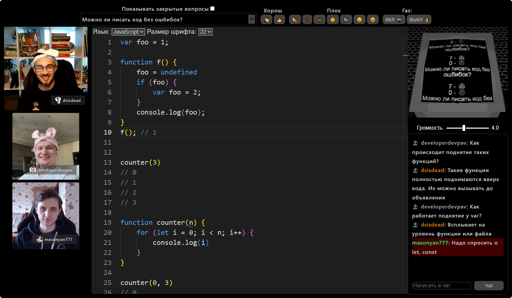

# GulagGazRoom

Интерактивная платформа для проведения собеседований с возможностью составления детальных отчётов.

## Возможности
* Видеочат
* Редактор кода
* Система оценок
* Запись речи в текстовом виде
* Автоматическое составление результатов собеседования

## Команда
|  |  |  |
| :------------: | :---------------: | :---------------: |
|  Дмитрий ([blowin](https://github.com/blowin)) | Павел ([developerdevpav](https://github.com/developerdevpav)) | Владислав ([VladislavPetyukevich](https://github.com/VladislavPetyukevich)) |
| 6 лет опыта коммерческой разработки Крупная логистическая компания | 6 лет опыта коммерческой разработки Крупныый российский банк | 6 лет опыта коммерческой разработки Крупные российские банки |
| Senior C# разработчик | Senior Java разработчик | Senior JS разработчик |
| Дополнительный опыт: Управление командой разработчиков | Дополнительный опыт: Управление командой разработчиков Собеседование разработчиков в команду | Дополнительный опыт: Управление командой разработчиков Собеседование разработчиков в команду Менторство над младшими разработчиками Собеседование младших разработчиков |
